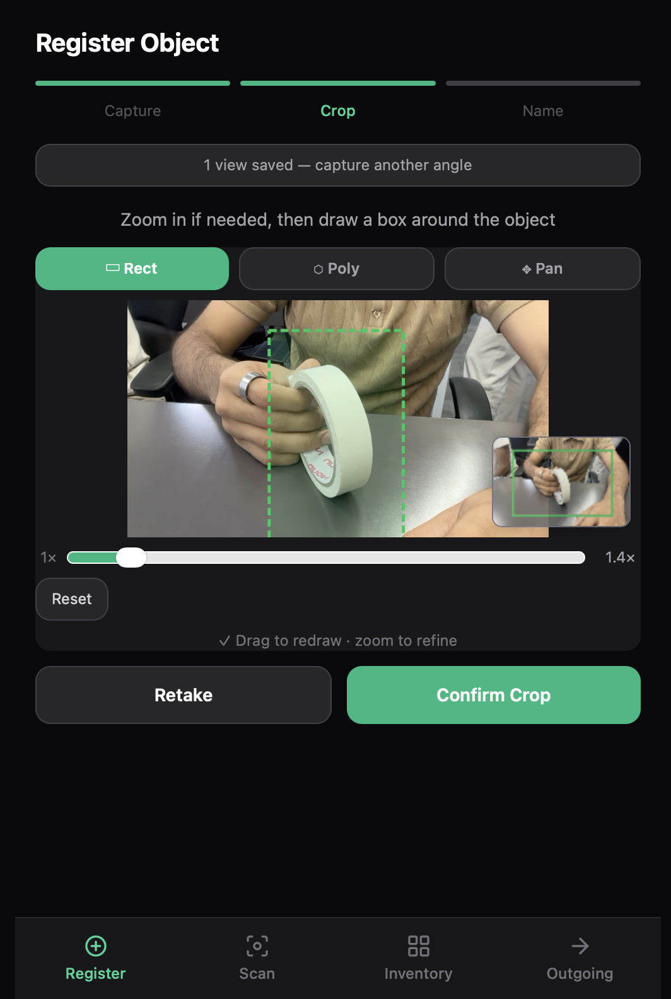
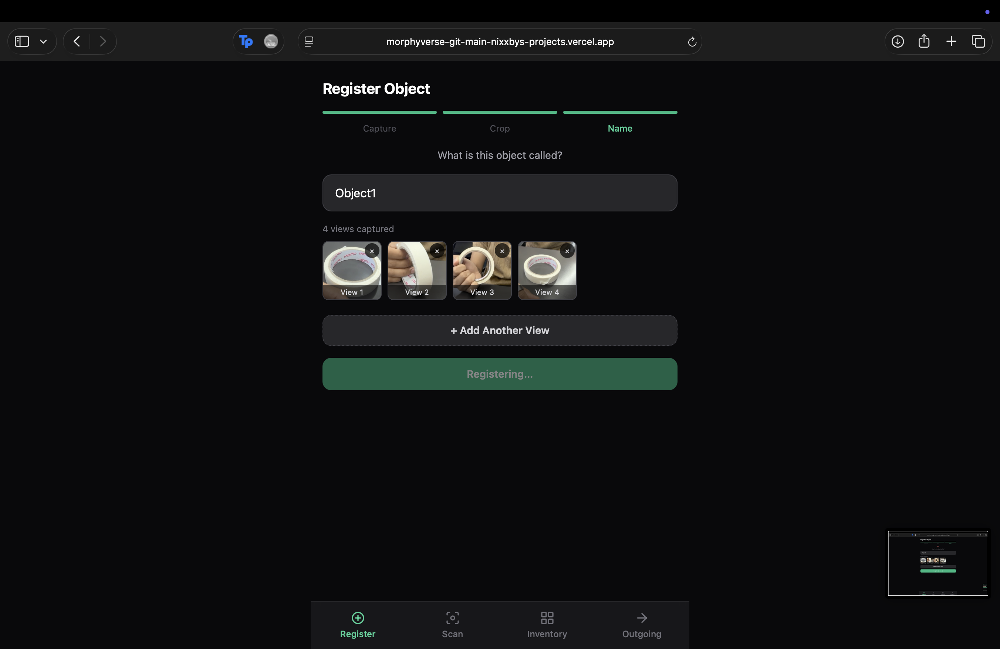
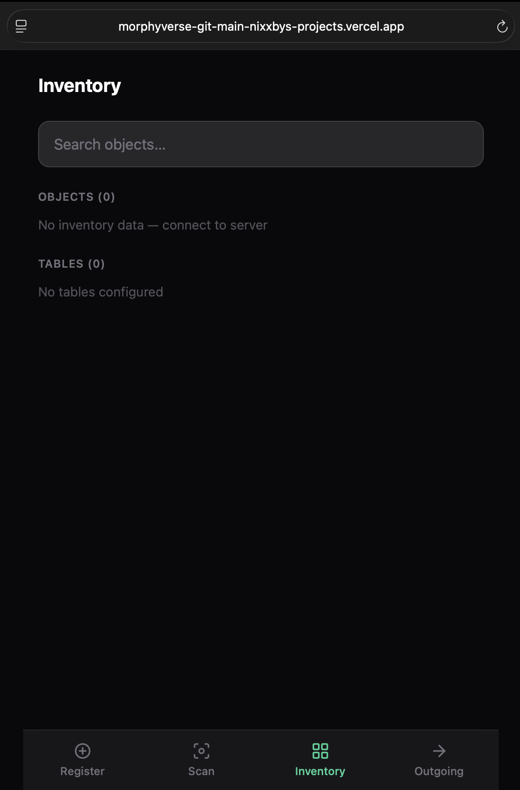

# MorphyVerse
### AI-Native Lab Inventory Tracking — No Barcodes. No Scanning. No Behavior Change.

---

## What Is This

Labs lose time every day to a simple problem: parts migrate from storage to someone's desk and nobody knows where they are.

MorphyVerse fixes this with a phone camera and AI. Point your phone at any workstation — the system identifies every tracked part in the frame, updates a live central inventory, and logs where everything is. Automatically. Continuously. With no barcodes, no RFID, no dedicated hardware, and no change to how people work.

Object registration takes under two minutes: open the app, take a photo of a new part, draw a bounding box around it, give it a name. That's it — the system can find that object in any scan from that moment forward, with no model training and no redeployment.

Built for robotics labs, wet labs, and hardware maker spaces.

---

## How It Works

```
Phone PWA  →  Replit Server  →  Inference Laptop (YOLOE-26)
               (inventory DB)
```

1. A phone running the MorphyVerse PWA opens its rear camera pointed at a workstation
2. Every 30 seconds, it captures a frame and sends it to the Replit server
3. The Replit server forwards the image to a laptop running YOLOE-26
4. YOLOE-26 identifies all registered objects in the frame using visual prompting — no training required
5. Detections are returned to Replit, which updates the inventory database and runs accounting logic
6. The phone renders bounding box overlays and the dashboard updates in real time

The laptop never receives requests from phones directly. The Replit server is the single hub — it relays images, runs inventory logic, and serves all data to the PWA.

---

## Usage Guide

### 1. Register a New Object

Open the app and tap **Register** in the bottom nav. The flow is three steps: Capture → Crop → Name.

**Capture** — point the rear camera at the object and tap **Capture Photo**.

**Crop** — the photo loads in an interactive canvas. Draw a tight bounding box around just the object.

- Switch between **Rect** (drag), **Poly** (tap vertices), and **Pan** (drag to navigate) modes
- Use the **zoom slider** to get precise control — the canvas zooms around the center
- The **minimap** appears in the bottom-right corner when zoomed in; tap anywhere on it to jump there
- The green magnifier loupe follows your finger for sub-pixel accuracy at the crop edge



Tap **Confirm Crop** when the selection looks right.

**Name** — enter what the object is called. All captured views are shown as thumbnails; tap × on any to remove it.



To register the same object from multiple angles, tap **+ Add Another View** before registering. This goes back to the camera, captures another crop, and adds it alongside the first. When you tap **Register**, each view is submitted separately — same name, separate object IDs — so YOLOE-26 can recognise the object regardless of orientation.

---

### 2. Scan a Table

Tap **Scan** in the bottom nav. Select the table you want to monitor, then tap **Start Scan**. The camera fires every 30 seconds automatically — point it at the workstation and leave it running. Bounding box overlays and toast notifications appear after each scan.

---

### 3. Check Inventory

Tap **Inventory** to see the live central count for every registered object and which tables are currently active.



Use the **Search objects** bar to locate a specific part — results show which table it's on and when it was last seen.

---

### 4. View the Outgoing Log

Tap **Outgoing** for an append-only record of every part consumed at a Production Table — what left, from which table, and at what time.

---

## The Core Insight: Two Types of Tables

Every workstation in the lab is registered as one of two types. This distinction drives all inventory accounting.

**Lab Table** — a research or engineering workstation. Parts checked out here are expected to come back.
- Object appears on table → subtracted from central inventory
- Object disappears from table (absent for 3 consecutive scans) → returned to central inventory

**Production Table** — an assembly or dispatch workstation. Parts that arrive here are consumed into products leaving the lab.
- Object appears on table → subtracted from central inventory
- Object disappears from table → logged to the Outgoing Registry permanently; not returned to central inventory

This means the central inventory always reflects reality: parts in storage, parts on lab benches (checked out), and parts consumed in production are all accounted for separately.

---

## Key Features

**Zero-friction registration**
Take a photo, draw a bounding box, type a name. YOLOE-26 extracts a visual embedding from the crop — no retraining, no model updates, no file distribution. The object is immediately detectable by every scan.

**Autonomous passive scanning**
Drop into Scan Mode on any phone, point at a table, leave it running. The camera fires every 30 seconds. No one has to do anything.

**Live inventory dashboard**
See every tracked object, its current count in central storage, and which table it's on if it's checked out.

**Location search**
Type "where is the 775 motor" — get back the table name and last-seen timestamp.

**Outgoing log**
A permanent, append-only record of every part consumed at a Production Table — what left, when, from which table, in what quantity.

**PWA — no install required**
Works in Chrome on Android (installable to home screen) and Safari on iPhone. Open a URL and start scanning.

---

## Tech Stack

| Layer | Technology |
|---|---|
| Phone app | React 18 + Vite PWA (Tailwind, Zustand, React Router) |
| Central server | Python FastAPI + SQLite on Replit |
| Inference | YOLOE-26s (`ultralytics >= 8.4.0`) on laptop via ngrok |
| Image relay | multipart/form-data over HTTPS |
| Detection | YOLOE-26 visual prompting — zero-shot, no training |

---

## YOLOE-26 Visual Prompting

MorphyVerse uses YOLOE-26 (Ultralytics, January 2026), an open-vocabulary segmentation model built on the YOLO26 architecture. It supports three inference modes: text prompts, visual prompts, and prompt-free. MorphyVerse uses **visual prompting**.

When a user registers an object, YOLOE-26's SAVPE (Spatially-Aware Visual Prompt Encoder) extracts a visual embedding from the reference crop. That embedding is stored in the database. At scan time, all registered embeddings are passed as prompts to a single YOLOE-26 forward pass, which returns bounding boxes for every matched object — with no retraining and no changes to model weights.

This is what makes single-shot registration possible. One photo is enough.

---

## Repository Structure

```
morphyverse/
├── inference/          # YOLOE-26 inference server (runs on laptop)
├── server/             # Replit server — inventory DB, relay, API
├── pwa/                # Phone PWA — React + camera + dashboard
└── README.md           # This file
```

---

## System Architecture

```
┌─────────────────────────────────────────────────────────┐
│                     PHONE (any)                         │
│                                                         │
│  MorphyVerse PWA (Chrome Android / Safari iOS)          │
│  - Camera capture every 30s                             │
│  - Registration bbox annotator                          │
│  - Dashboard + search + outgoing log                    │
└───────────────────┬─────────────────────────────────────┘
                    │ HTTPS  (all traffic)
        ┌───────────▼──────────────┐
        │     REPLIT SERVER         │
        │                          │
        │  FastAPI + SQLite         │
        │  Inventory engine         │
        │  Lab / Production logic   │
        │  All API endpoints        │
        └───────────┬──────────────┘
                    │ HTTPS via ngrok
        ┌───────────▼──────────────┐
        │    LAPTOP (local)         │
        │                          │
        │  YOLOE-26s (Python)       │
        │  FastAPI relay receiver   │
        │  Embedding extractor      │
        │  Inference engine         │
        └──────────────────────────┘
```

---

## Data Model

**`objects`** — every registered part, with its YOLOE-26 visual embedding

**`tables`** — every workstation, typed as `lab` or `production`

**`central_registry`** — the live count of each object currently in storage (not on any table)

**`table_inventory`** — what is currently on each table, with a grace-period counter for disappearance detection

**`outgoing_registry`** — immutable log of every part consumed at a Production Table

**`scan_log`** — every scan ever submitted: table, timestamp, detections, latency

---

## Inventory State Machine

```
                    ┌─────────────────┐
                    │ CENTRAL STORAGE │
                    └────────┬────────┘
                             │ detected on table
                    ┌────────▼────────┐
                    │   ON TABLE      │
                    │ (table_inventory)│
                    └────┬───────┬────┘
                         │       │
              lab table  │       │  production table
              disappears │       │  disappears
                         │       │
               ┌─────────▼─┐  ┌──▼──────────────┐
               │  RETURNED  │  │  OUTGOING LOG   │
               │ to central │  │  (consumed)     │
               └────────────┘  └─────────────────┘
```

Grace period: an object must be absent from 3 consecutive scans before a state transition fires.

---

## API Surface (Summary)

All endpoints on the Replit server. Phones call all of these. The inference laptop calls none of them except `GET /api/embeddings`.

| Method | Path | Who calls it | Purpose |
|---|---|---|---|
| `POST` | `/api/scan` | PWA | Submit scan frame → get detections + inventory events |
| `POST` | `/api/register` | PWA | Register new object → store embedding |
| `GET` | `/api/embeddings` | Inference laptop | Sync visual embeddings |
| `GET` | `/api/tables` | PWA | List all tables |
| `POST` | `/api/tables` | PWA | Create a table |
| `PATCH` | `/api/tables/{id}` | PWA | Update table label |
| `GET` | `/api/inventory` | PWA | Global central counts |
| `GET` | `/api/inventory/locate` | PWA | Find which table has an object |
| `GET` | `/api/inventory/outgoing` | PWA | Outgoing consumption log |
| `GET` | `/api/health` | PWA / monitoring | Server + inference reachability |

The inference laptop exposes three endpoints called only by the Replit server:

| Method | Path | Purpose |
|---|---|---|
| `POST` | `/detect` | Run YOLOE-26 on a scan frame |
| `POST` | `/register` | Extract visual embedding from a crop |
| `GET` | `/health` | Model status + embedding count |

---

## Setup

### Prerequisites
- Python 3.11
- Node 20+
- `ultralytics >= 8.4.0` and a GPU or capable CPU on the laptop
- Replit account (free tier works)
- ngrok account (free tier works)

### 1. Inference Server (laptop)

```bash
cd inference
pip install -r requirements.txt
# Download yoloe-26s-seg.pt — see inference/README.md
cp .env.example .env        # set REPLIT_SERVER_URL
uvicorn main:app --host 0.0.0.0 --port 8000
ngrok http 8000             # copy the public HTTPS URL
```

### 2. Replit Server

```
1. Create a new Python Replit project
2. Upload the /server directory
3. pip install -r requirements.txt
4. Set Replit Secret: INFERENCE_SERVER_URL = <ngrok URL from step 1>
5. alembic upgrade head
6. Run — Replit gives you a public HTTPS URL
```

### 3. Phone PWA

```bash
cd pwa
npm install
cp .env.example .env        # set VITE_API_BASE_URL to Replit URL from step 2
npm run build
# Deploy dist/ to Vercel or Replit Static (must be HTTPS)
# Open URL in Chrome on Android — tap "Add to Home Screen"
```

---

## Environment Variables

**`inference/.env`**

| Variable | Description | Default |
|---|---|---|
| `REPLIT_SERVER_URL` | Full URL of Replit server | required |
| `SYNC_INTERVAL` | Seconds between embedding syncs | `60` |
| `DEFAULT_CONF` | Detection confidence threshold | `0.55` |

**Replit Secrets**

| Variable | Description |
|---|---|
| `INFERENCE_SERVER_URL` | ngrok public URL of inference laptop |
| `GRACE_PERIOD` | Consecutive absent scans before state change |

**`pwa/.env`**

| Variable | Description |
|---|---|
| `VITE_API_BASE_URL` | Full URL of Replit server |

---

## Limitations (v1)

- Occlusion: a part buried under papers won't be detected. The 3-scan grace period prevents false inventory updates from momentary occlusion.
- Counting small identical parts (e.g. 20 M3 screws) is approximate — YOLOE-26 may under-count due to clustering.
- iOS Safari: camera works, but background scan loop requires the app to stay in the foreground.
- ngrok free tier restarts periodically, requiring `INFERENCE_SERVER_URL` to be updated in Replit Secrets.
- Single central count per object across all tables — no per-SKU or per-serial tracking in v1.

---